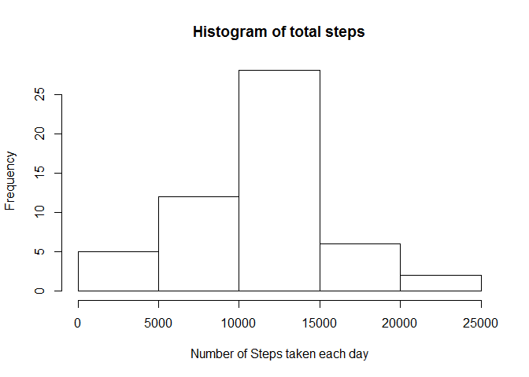
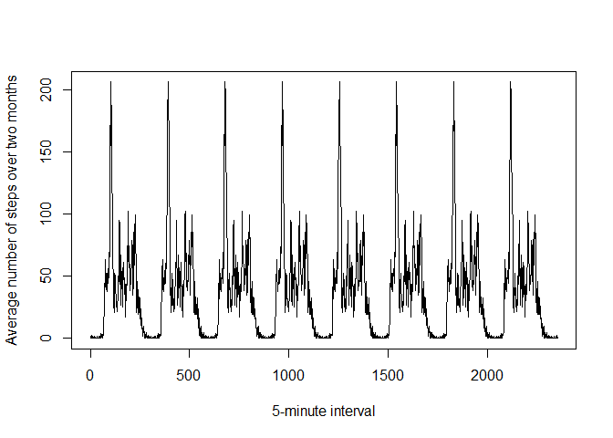
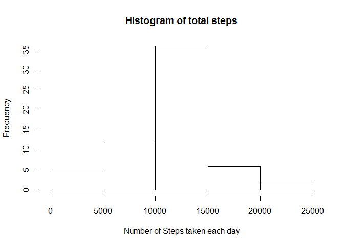

# Reproducible Research: Peer Assessment 1


## Loading and preprocessing the data


```r
# Unzip the data file
unzip("activity.zip")
# Read the data file
dataTemp <- read.csv("activity.csv")
# Remove missing values
data <- na.omit(dataTemp)
```


## What is mean total number of steps taken per day?

### First find the total number of steps taken per day, then plot the histogram. Finally find the mean and the median of the total number of steps.


```r
# Sum the steps taken for each day using the data without missing values
totalSteps <- aggregate(data$steps, list(day = data$date), sum)
# Plot the histogram of the sums
hist(totalSteps$x, main = "Histogram of total steps", xlab = "Number of Steps taken each day")
```

 

```r
# Calcuate the mean of the sums
mean(totalSteps$x)
```

```
## [1] 10766.19
```

```r
# Calculate the median of the sums
median(totalSteps$x)
```

```
## [1] 10765
```

## What is the average daily activity pattern?

### First find the average number of steps for each interval over the two month period. Then plot the time series for the average. Finally find the 5-minute interval with the maximum average number of steps.


```r
# Calculate the mean number of steps for each interval
intervals <- aggregate(data$steps, list(intv = data$interval), mean)
# Plot the time series for the average number of steps taken
tsInt <- ts(intervals$x, start=intervals[1,1], end=intervals[nrow(intervals),1])
plot(tsInt, type = "l", xlab = "5-minute interval", ylab = "Average number of steps over two months")
```

 

```r
# Find the 5-minute interval with the maximum average number of steps
intervals[which.max(intervals$x),1]
```

```
## [1] 835
```
  
## Inputing missing values

### Use the data loaded originally in this part. First count the number of rows with missing values. Next fill the missing values for the 5-minute interval with the mean over the two month period and create a new data set with the missing values filled. 

### Finally, plot the histogram of the total number of steps taken each day, and calculate the mean and median of the total number. The mean of the number of steps does not change after filling in the missing values. The median changes only slightly. This impact is expected since the missing values are filled with the mean values over the two month period. As for the total number of steps taken each day it is larger after the missing values are filled as would be expected. 


```r
# Calculate the total number of missing values 
# First use the originally read data frame to create a new data frame with rows which have NA in the steps column, then count the number of rows in the data frame.
dataNA <- subset(dataTemp, is.na(dataTemp$steps))
nrow(dataNA)
```

```
## [1] 2304
```

```r
# The missing values will be filled using the mean of the interval.

# Copy the originally loaded data into the data frame which will eventually contain the missing values filled in
dataFilled <- dataTemp
# Replicate the intervals data frame to the row size of the original data so it can be concatenated with dataFilled
intervals2 <- as.data.frame(lapply(intervals,function(x)rep(x,length.out=nrow(dataFilled)))) 

# Add the mean column of intervals2 to dataFilled to create the data frame intvAll
intvAll <- cbind(dataFilled,intervals2$x)
# Rename the new column in the new data frame intvAll
colnames(intvAll)[4] <- "stepsMean"
# Substitute the NA values in the steps column by the value in the mean column, which corresponds to that for the interval
intvAll$steps <- ifelse(is.na(intvAll$steps), intvAll$stepsMean, intvAll$steps)

# Set dataFilled to be the first 3 columns of intvAll
dataFilled <- intvAll[,1:3]

# Calculate the total number of steps taken each day and plot the histogram
totalStepsFilled <- aggregate(dataFilled$steps, list(day = dataFilled$date), sum)
hist(totalStepsFilled$x, main = "Histogram of total steps", xlab = "Number of Steps taken each day")
```

 

```r
# Calcuate the mean of the sums
mean(totalStepsFilled$x)
```

```
## [1] 10766.19
```

```r
# Calculate the median of the sums
median(totalStepsFilled$x)
```

```
## [1] 10766.19
```

```r
# The total number of steps taken each day is larger after the missing values are filled as would be expected. 
```


## Are there differences in activity patterns between weekdays and weekends?

### First create a new factor variable in the data, which indicates whether the date is a weekday or weekend. Next plot the average number of steps for each 5-minute interval for the weekdays and weekends separately.


```r
# Create the factor variable
fdays = factor(c(1,2), labels = c("weekday", "weekend"))
# Add a new column to the data which comprises a factor variable indicating whether the date is a weekday or weekend
dataFilled$days <- factor(ifelse(weekdays(as.Date(dataFilled$date))=="Saturday"|weekdays(as.Date(dataFilled$date))=="Sunday", fdays[2], fdays[1]))
# The above operation puts in numbers (1, 2, etc.) as labels. Therefore a second operation is needed to set the labels to those of fdays
dataFilled$days = factor(dataFilled$days, labels=levels(fdays))

# For plotting:
# Take the means over the intervals for each of the weekdays and weekends
dataPlot <- aggregate(dataFilled$steps, list(intv=dataFilled$interval, day=dataFilled$days), mean)

# Plot
library(lattice)
xyplot(x~intv|day, data=dataPlot, type="l", xlab="interval", ylab="Number of steps", layout=c(1,2))
```

 
